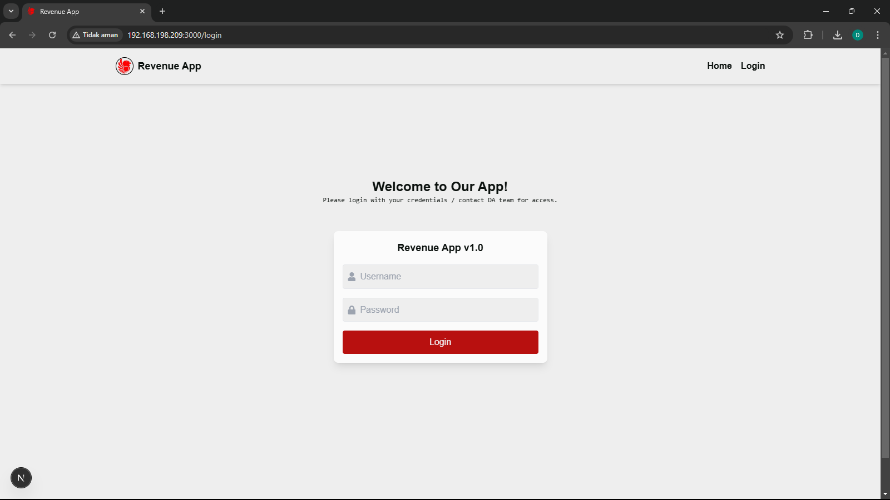
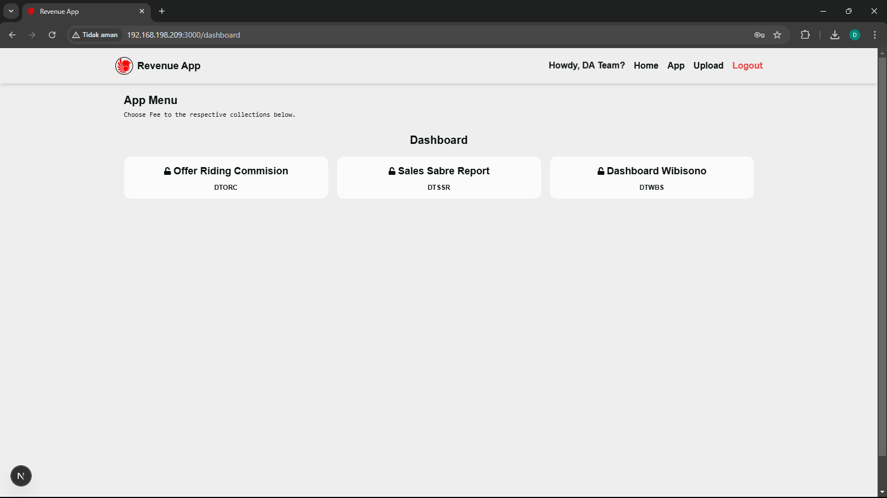
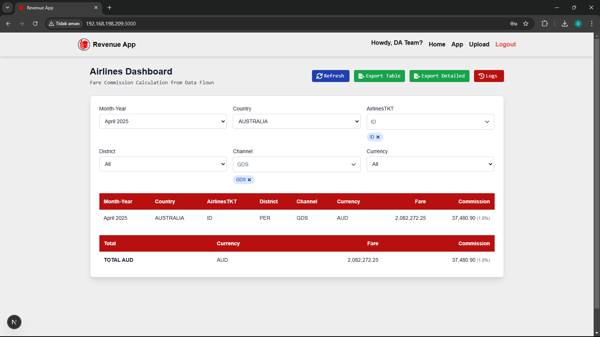
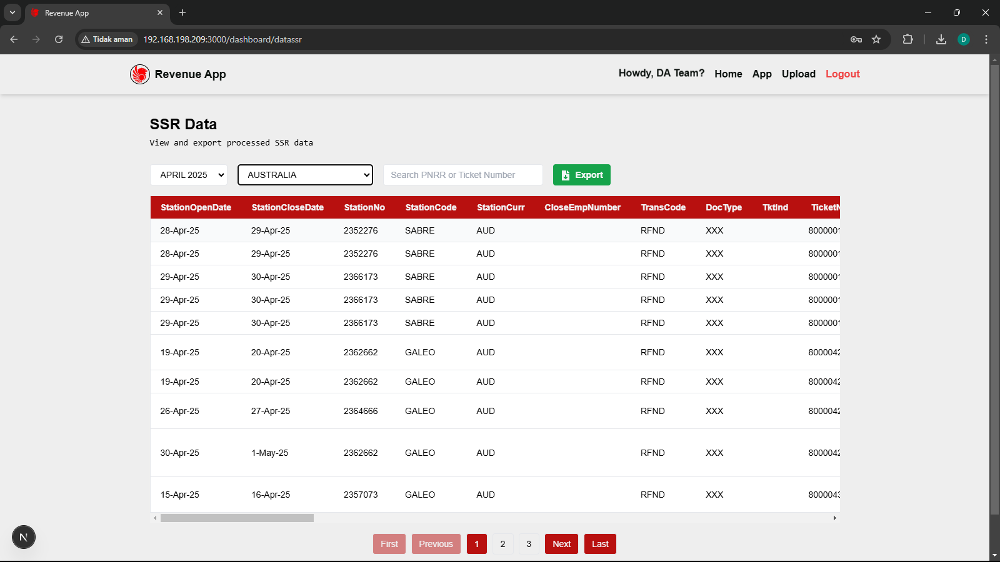
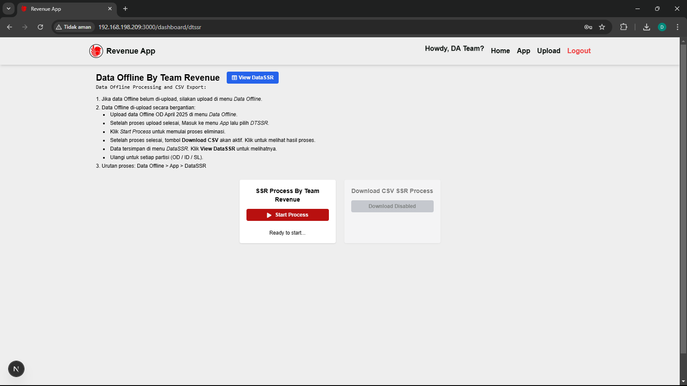
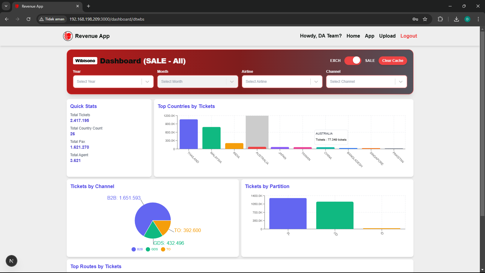
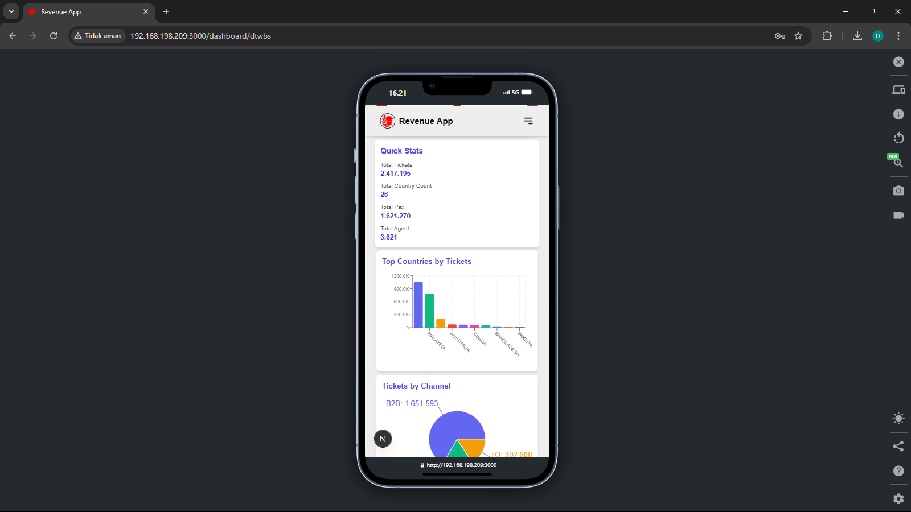
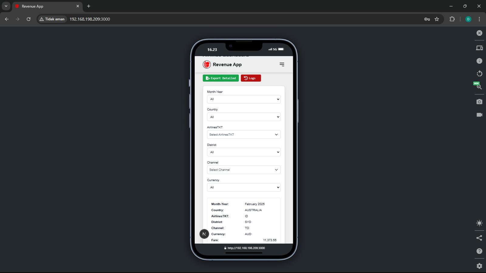

# RevenueApp

A full-stack web application for airline ticket data management, built with Next.js (frontend) and Go (backend with Gin and MongoDB). The app provides a responsive dashboard for viewing, filtering, and exporting SSR ticket data, along with CSV upload and data processing capabilities.

## Project Structure

```
revenueapp/
├── backend/
│   ├── main.go
│   ├── db/
│   │   └── mongo.go
│   ├── handlers/
│   │   ├── uploadCSV.go
│   │   ├── dashboardManagement.go
│   │   ├── dashboardSummary.go
│   │   ├── getSSRData1.go
│   │   ├── getSSRFilterOptions.go
│   │   ├── exportFilteredCSV.go
│   │   └── ...
│   ├── models/
│   │   ├── DataFpr.go
│   │   ├── DataFmr.go
│   │   ├── dashboard_ssr.go
│   │   └── ...
│   └── routes/
│       └── ...
├── frontend/
│   ├── app/
│   │   ├── upload/page.tsx
│   │   ├── dashboard/page.tsx
│   │   ├── DataSSRPage.tsx
│   │   └── ...
│   ├── pages/
│   ├── public/
│   ├── styles/
│   │   └── globals.css
│   ├── components/
│   │   ├── ProtectedRoute.tsx
│   │   ├── SubpageGuard.tsx
│   │   └── ...
│   ├── package.json
│   ├── .env.local
│   └── ...
├── .env
├── .gitignore
├── README.md
└── LICENSE
```

## Features

- **Frontend (Next.js)**:
  - Responsive UI with Tailwind CSS for desktop, tablet, and mobile.
  - SSR data dashboard (`DataSSRPage.tsx`) with filtering (by issued date, country), searching (PNRR, Ticket Number), and CSV export.
  - CSV upload interface (`upload/page.tsx`) for data ingestion.
  - Role-based authentication with protected routes (`ProtectedRoute.tsx`, `SubpageGuard.tsx`).
- **Backend (Go, Gin, MongoDB)**:
  - REST API with endpoints for data retrieval (`/getSSRData1`), filter options (`/getSSRFilterOptions`), and CSV export (`/exportFilteredCSV`).
  - CSV parsing, batch processing, and duplicate handling (`uploadCSV.go`).
  - MongoDB aggregation pipelines for summaries (`dashboardSummary.go`).
  - Server-Sent Events (SSE) for long-running tasks.
- **Authentication**: Role-based access control for upload and dashboard features.
- **Data Processing**: Validates and processes airline ticket data across collections (`dashboard_ssr`, `DataFpr`, `DataFmr`).
- **Performance**: MongoDB indexes on `PNRR` and `TicketNumber` for efficient searches.

## Getting Started

### Prerequisites

- **Node.js**: v18 or higher
- **Go**: v1.20 or higher
- **MongoDB**: Local instance or cloud (e.g., MongoDB Atlas)
- **Git**: For cloning the repository

### Backend Setup

1. **Clone the Repository**:
   ```sh
   git clone https://github.com/amirakbarwicaksono/revenueapp.git
   cd revenueapp
   ```

2. **Configure Environment**:
   - Copy `backend/.env.example` to `backend/.env`:
     ```sh
     cp backend/.env.example backend/.env
     ```
   - Edit `backend/.env` to set:
     ```env
     MONGODB_URI=mongodb://localhost:27017
     MONGODB_DATABASE=revenueapp
     ```

3. **Set Up MongoDB Indexes**:
   - Connect to your MongoDB instance (e.g., using `mongo` or MongoDB Compass).
   - Create indexes for the `dashboard_ssr` collection:
     ```javascript
     use revenueapp
     db.dashboard_ssr.createIndex({ "PNRR": 1 });
     db.dashboard_ssr.createIndex({ "TicketNumber": 1 });
     ```

4. **Install Go Dependencies**:
   ```sh
   cd backend
   go mod tidy
   ```

5. **Run the Backend Server**:
   ```sh
   go run main.go
   ```
   - The server runs at `http://localhost:8080` (or your configured port).

### Frontend Setup

1. **Configure Environment**:
   - Copy `frontend/.env.local.example` to `frontend/.env.local`:
     ```sh
     cp frontend/.env.local.example frontend/.env.local
     ```
   - Edit `frontend/.env.local` to set:
     ```env
     NEXT_PUBLIC_API_URL=http://localhost:8080
     ```

2. **Install Node Dependencies**:
   ```sh
   cd frontend
   npm install
   ```

3. **Run the Frontend App**:
   ```sh
   npm run dev
   ```
   - The app runs at `http://localhost:3000`.

## Usage

- **Upload Data**:
  - Navigate to `http://localhost:3000/upload`.
  - Select a collection (e.g., `dashboard_ssr`), date/month, and upload a CSV file.
- **SSR Dashboard**:
  - Go to `http://localhost:3000/DataSSRPage`.
  - Filter data by issued date or country, search by PNRR or Ticket Number, and export results as CSV.
- **Protected Routes**:
  - Access to `/upload` and `/DataSSRPage` requires authentication with appropriate roles (configured via `SubpageGuard.tsx`).

## Frontend Display

To help users visualize the UI, here are example screenshots of the upload and dashboard pages. Place your images in `frontend/public/screenshots/` and reference them below:

### Login Page



### App Page



### Home Page



### SSR View Page




### SSR Process Page



### SSR Dashboard



### Moblie View Dashboard





## License

See [LICENSE](LICENSE) for details (e.g., MIT License, if applicable).

---

*For more details, see code comments, directory-specific READMEs, or contact the repository maintainer.*